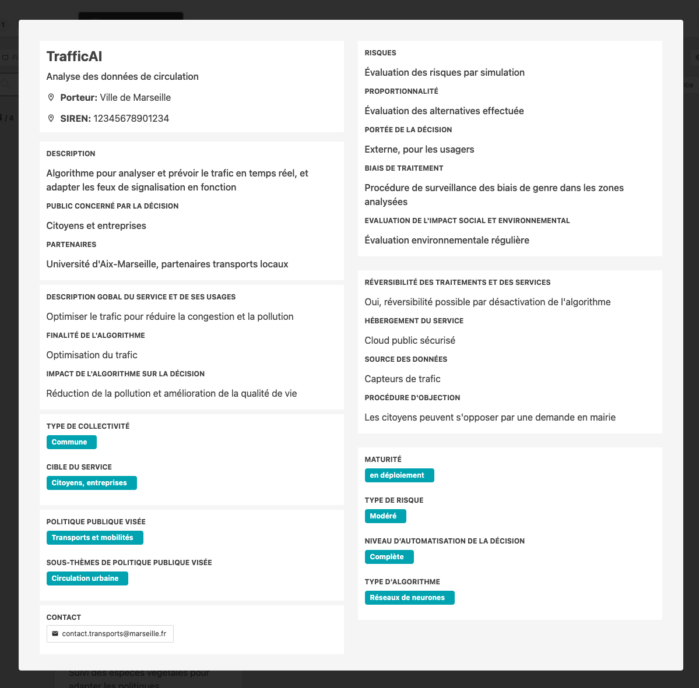

#### CHAMPS PUBLICS

- coll_nom
- nom_projet
- coll_siret
- longitude
- latitude
- coll_type
- projet_date
- projet_status
- status_abandon
- partenaires
- projet_contact
- financement
- budget
- usage_description
- mise_en_oeuvre
- theme
- sous_theme
- audience_service
- url_infos
- image_url
- date

### CHAMPS RESTREINTS

- projet_contact
- financement
- budget
- usage_description
- mise_en_oeuvre
- theme
- sous_theme
- audience_service
- herbergement
- nom_algorithme
- algorithme_description
- algorithme_operations
- type_algorithme
- impact_environnement
- donnees_source
- donnees_acces
- url_ressources

**LES PROJETS DOCUMENTES ICI SONT FICTIFS ET SERVENT A L'ELABORATION D'UN TRAVAIL EN COURS.**

Face à l’accélération des usages de l’IA et la diffusion massive de ces outils dans la vie publique, la commission numérique commune aux Interconnectés*, France urbaine et Intercommunalités de France s’est engagée en juillet 2023 à déployer la stratégie des « Intelligences Associées des territoires ». Elle vise à inscrire l’IA dans les exigences d’un numérique responsable.

Trois orientations complémentaires sont alors développées. 

- L’IA au service des politiques publiques ; cet axe vise au recensement et à la documentation des projets portées par les collectivités. L’association travaille au développement d’une bibliothèque d’IA territoriale et à l’animation d’une communauté d’acteurs en partenariat avec Ecolab.

- IA éthique et vie publique ; l’objectif est de mettre en débat les conditions de déploiement de ces systèmes et de faire remonter les attentes, points de vigilances, propositions à l’échelle des territoires. L’association a lancé le 18 septembre 2024 les concertations territoriales de l’IA qui encouragent le débat local et permettront de consolider une vision nationale commune.

- IA et transformation des métiers de la fonction publique territoriale ; nourri par l’élaboration d’études, cet axe vise à identifier les impacts et à encadrer les usages de l’IA afin de s’assurer que l’humain reste au cœur du fonctionnement des collectivités. 

## Collecte et valorisation des usages de l’IA par les collectivités territoriales 

Cette bibliothèque s’inscrit pleinement dans la feuille de route de la commission qui permet de :

1. Recenser et qualifier les cas d’usages de systèmes d’IA dans les collectivités territoriales
2. Documenter les méthodes et les moyens déployés
3. Cartographier les acteurs et les solutions ressources
4. Documenter et partager des ressources techniques (codes, bases de données, modèles d’entraînement, …)
5. Répondre au besoin de transparence et d’explicabilité des algorithmes déployés au sein des collectivités territoriales

## Méthodologie

Un travail collectif, regroupant plusieurs agents et élus de collectivités territoriales, a permis de préciser les besoins et les usages de cette bibliothèque. Ensemble, un modèle de données visant à structurer la documentation des projets ayant recours à l’IA a été produit.  

## A propos des Interconnectés

*Les Interconnectés est la première association nationale de collectivités centrée sur les politiques publiques numériques. Créée en 2009 par Intercommunalités de France et France urbaine, sa mission est d’accompagner les collectivités locales et leurs groupements pour mettre l’innovation et le numérique au service des territoires. Elle est aussi un interlocuteur de référence de l’État. Elle mobilise différents acteurs afin de faire émerger des solutions concrètes fondées sur le partage, l’intelligence collective et la proximité de l’usager.

## Demo

<!-- - Demo html page: [](https://app.netlify.com/sites/datami-demo-ping-tiers-lieux/deploys)
- demo url: https://datami-demo-ping-tiers-lieux.netlify.app -->




---

## To go further

### Datami

The widget is an integral part of the [Datami](https://gitlab.com/multi-coop/datami) project

### Technical documentation

A site dedicated to Datami technical documentation can be consulted here: https://datami-docs.multi.coop

---

## Mini server for local development

A mini server is writen in the `server.py` to serve this folder's files.

To install the mini-server :

```sh
pip install --upgrade pip
python3 -m pip install --user virtualenv
python3 -m venv venv
source venv/bin/activate
pip install --upgrade pip
pip install -r requirements.txt
```

or

```sh
sh setup.sh
source venv/bin/activate
```

---

### Run local server

To run the server on `http://localhost:8810`:

```sh
python server.py
```

or

```sh
sh run_server.sh
```

Files will be locally served on :

- `http://localhost:8810/content/<path:folder_path>/<string:filename>`
- `http://localhost:8810/statics/<path:folder_path>/<string:filename>`

---

## Crédits

| | logo | url |
| :-: | :-: | :-: |
| **Les Interconnectés** |  | https://www.interconnectes.com/ |
